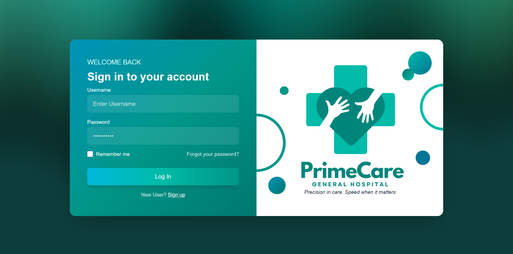
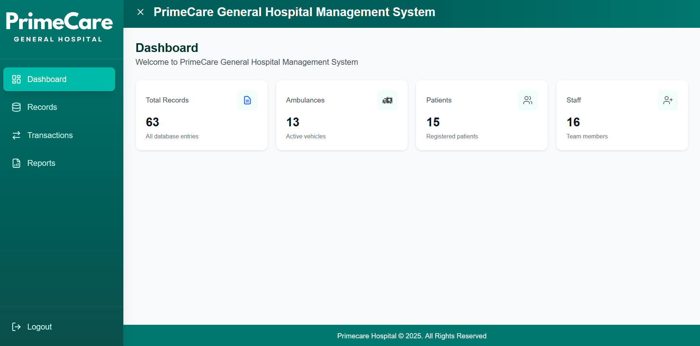
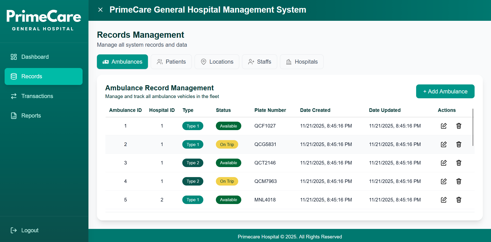
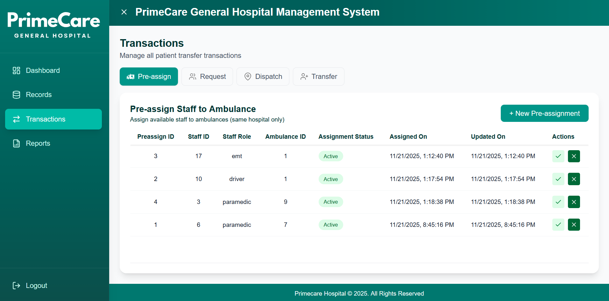
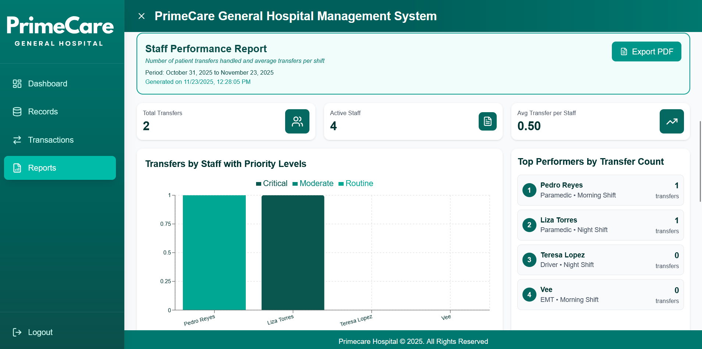

### A Hospital Management System developed for the Information and Management (CCINFOM) course.

|  |   |
|:--:|:--:|
|   |  |

## Installation
### Prerequisites
- [Node.js](https://nodejs.org/en/download/current)
- [npm](https://docs.npmjs.com/downloading-and-installing-node-js-and-npm)
- [MySQL](https://dev.mysql.com/downloads/installer/)

### Build from source

```bash
# Clone the repository
git clone https://github.com/angele34/CCINFOM-S22-06.git

# Setup your database:
# Import the SQL schema into MySQL Workbench 
# Create your own .env file and fill in your database credentials

# Sync the database with Prisma
npx prisma db pull
npx prisma generate

# Run the application with npm
npm install
npm run dev

# Access the application in your browser
http://localhost:3000
```

## Tech stack

| Project              | Home Page                      |
|----------------------|--------------------------------|
| Tailwind CSS         | [tailwindcss.com](https://tailwindcss.com/) |
| Next.js              | [nextjs.org](https://nextjs.org/)          |
| TypeScript           | [typescriptlang.org](https://www.typescriptlang.org/) |
| React.js               | [reactjs.org](https://reactjs.org/)       |
| MySQL | [mysql.com](https://www.mysql.com/)
| Prisma | [prisma.io](https://www.prisma.io/)